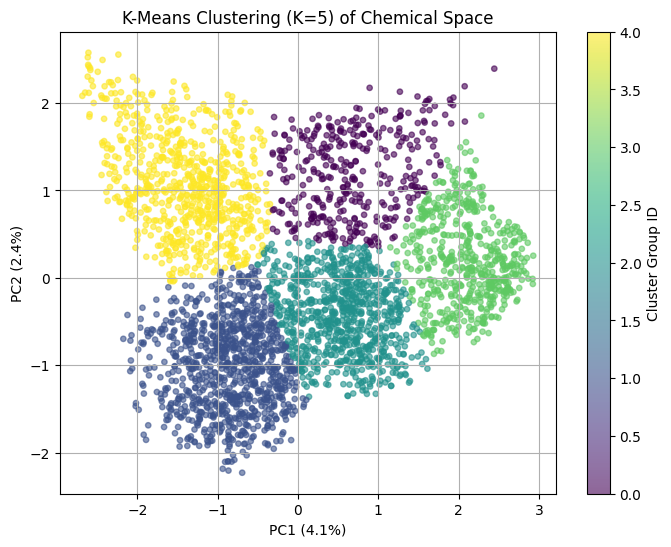
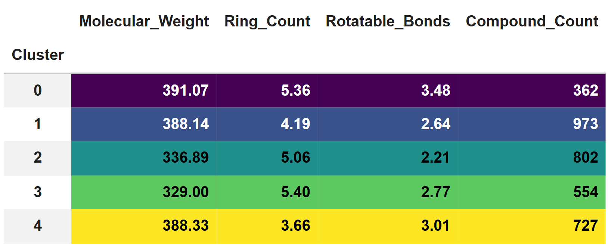
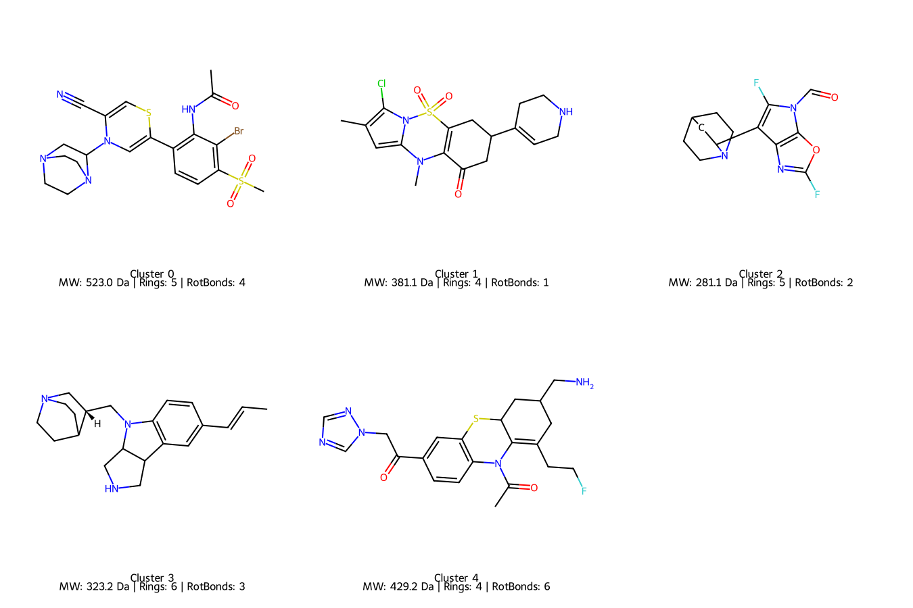

# 10H-Phenothiazine Derivatives: Chemical Space & Diversity Analysis

An end-to-end computational chemistry and machine learning workflow for evaluating the structural diversity of **3,418 generated 10H-phenothiazine derivatives**.

## Overview
This repository contains the Python scripts and notebooks used to encode molecular structures into high-dimensional circular fingerprints (ECFP4 equivalent) and perform unsupervised dimensionality reduction (PCA) coupled with K-Means clustering ($K=5$). 

The objective is to verify that generative design produced a broad structural space rather than redundant scaffold variants prior to downstream computational screening.

---

## Visual Workflow & Key Results

### 1. K-Means Chemical Space Mapping (K=5)


### 2. Sub-Library Physicochemical Profiles


### 3. Cluster Centroid Representative Compounds


---

## Key Workflow Steps
1. **Fingerprint Generation:** 1024-bit Morgan Fingerprints (`radius=2`) computed via `RDKit`.
2. **Dimensionality Reduction:** 2D Principal Component Analysis (PCA).
3. **Sub-Library Partitioning:** K-Means clustering ($K=5$) to isolate distinct chemical sub-spaces.
4. **Centroid Extraction:** Identification of representative compounds sitting closest to each cluster center.
5. **Visualization:** High-resolution 2D chemical structure grid rendering with property annotations.

## Output Highlights
- **Total Compounds Analyzed:** 3,418
- **Cumulative Explained Variance (PC1 + PC2):** 6.5% (Typical for sparse binary bit vectors)
- **Representative Cluster Scaffolds:** Extracted and saved to `cluster_representatives_grid.png`

## Dependencies & Requirements
- Python 3.x
- RDKit
- Scikit-Learn
- Pandas & NumPy
- Matplotlib

## How to Run
Run the Jupyter Notebook directly in Google Colab or clone this repository:
```bash
git clone [https://github.com/your-username/10H-Phenothiazine-Chemical-Space-PCA.git](https://github.com/your-username/10H-Phenothiazine-Chemical-Space-PCA.git)
